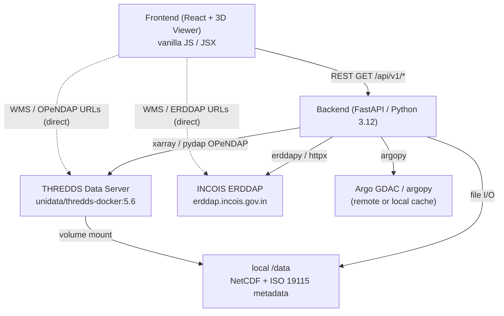

# EchoShield — Codebase Analysis

## Overview

**EchoShield** is a **3D ocean-data visualization platform** built by Kartik Sharma. It ingests real scientific datasets (NetCDF, ERDDAP, Argo floats, THREDDS catalogs) and serves them through a FastAPI backend to a React-based 3D frontend.

---

## Architecture



---

## Repository Structure

```
Echosheild/
├── backend/            # Python FastAPI application
│   ├── app/
│   │   ├── main.py             # App factory, lifespan, error handlers
│   │   ├── api/routes/         # Route handlers: health, model_data, argo, glider
│   │   ├── core/               # Config (pydantic-settings), logging, reliability
│   │   ├── ingestion/          # NetCDF parser, Argo client, THREDDS client,
│   │   │                       # ISO 19115 parser, variable mapping
│   │   ├── models/schemas.py   # All Pydantic response models
│   │   └── services/           # DatasetRegistry, ModelDataService, GliderService
│   ├── tests/
│   └── pyproject.toml          # uv-managed, Python 3.12, hatchling build
├── frontend/           # React + JSX (very early / skeleton stage)
│   └── src/
│       ├── components/
│       │   ├── Viewer3D/       # OceanViewer, VolumeRenderer, SceneManager, InstrumentMarkers
│       │   ├── Controls/       # DepthSlider, TimeControls, VariableSelector, ColorbarEditor, LayerControls
│       │   ├── Layout/
│       │   └── ProfileChart/
│       ├── hooks/              # useOceanData, useTimeAnimation
│       ├── services/           # api.js, modelService.js, argoService.js, gliderService.js
│       ├── store/              # oceanStore.js (empty)
│       └── utils/              # colorUtils, depthUtils, formatters
├── data/               # Local NetCDF files + ISO 19115 sidecar metadata
├── docs/
│   ├── api-contract.md         # Full verified API spec
│   └── frontend-handoff.md     # Frontend integration guide
├── infra/
│   └── docker-compose.yml      # backend + thredds services
├── scripts/
└── thredds/            # THREDDS catalog configuration
```

---

## Backend — Deep Dive

### Tech Stack
| Concern | Library |
|---|---|
| Web framework | FastAPI ≥ 0.115, Uvicorn |
| Data validation | Pydantic v2, pydantic-settings |
| Scientific I/O | xarray, netCDF4, h5netcdf, pydap, dask |
| Argo observations | argopy, erddapy |
| HTTP client | httpx, tenacity (retry/backoff) |
| Serialization | orjson |
| Linting / type-check | ruff, mypy (strict) |
| Testing | pytest, pytest-asyncio, pytest-cov |
| Build | hatchling, uv |

### Application Layers

#### 1. [`main.py`](file:///c:/Users/karti/Downloads/Echosheild/backend/app/main.py) — App factory
- **`create_app()`** sets up FastAPI, CORS (GET-only), request logging, and four routers.
- **`_lifespan_for()`** runs at startup: directory creation, dataset discovery, service wiring. Cleanly tears down on shutdown (closes xarray handles, HTTP clients).
- Exception handlers translate domain errors to HTTP codes:
  - `KeyError` → 404, `ValueError` → 422, upstream errors → 503, `DatasetNotAccessibleError` → 503.

#### 2. [`services/dataset_registry.py`](file:///c:/Users/karti/Downloads/Echosheild/backend/app/services/dataset_registry.py) — Dataset discovery
- Discovers datasets from three sources:
  1. **Local NetCDF files** under `NETCDF_DATA_ROOT` — read-probed to skip corrupt files.
  2. **ISO 19115 XML sidecars** — matched by stem or ERDDAP hash-suffix prefix. The ISO product identifier becomes the stable dataset ID.
  3. **THREDDS catalog** — discovered asynchronously in the background, never blocks startup.
- **`_register()`** is idempotent; accessible paths win over metadata-only entries.
- Dataset IDs are **deterministic** and registry-locked (no arbitrary path traversal).

#### 3. [`services/model_service.py`](file:///c:/Users/karti/Downloads/Echosheild/backend/app/services/model_service.py) — Data serving
- **LRU xarray dataset cache** (max 4 open handles, thread-safe `OrderedDict` + `Lock`).
- Serves: `metadata`, `variables`, `times`, `depths`, `slice`, `profile`, `point`, `currents`.
- **Canonical variable resolution** — frontend uses stable names (`temperature`, `salinity`); raw source names (`TEMP`, `SAL`) still accepted for back-compat.
- **Currents** are metadata-driven (CF standard names); never fabricated — returns `{"available": false}` when absent.

#### 4. [`ingestion/`](file:///c:/Users/karti/Downloads/Echosheild/backend/app/ingestion) — Data parsers
| File | Responsibility |
|---|---|
| `netcdf_parser.py` (20 KB) | xarray open/close, slice/profile/point extraction, coordinate normalization, NaN→null |
| `variable_mapping.py` (9 KB) | CF standard name + convention-based canonical variable classification |
| `iso19115_parser.py` (8 KB) | XML parsing of ISO 19115 metadata records |
| `thredds_client.py` (8 KB) | Async THREDDS catalog discovery, OPeNDAP/WMS URL construction |
| `argo_client.py` (13 KB) | argopy-based Argo float queries (remote ERDDAP/GDAC or local cache) |
| `argo_local.py` (11 KB) | Local NetCDF Argo profile reader |
| `text_parser.py` (5 KB) | CSV/text tabular data parser |

#### 5. [`api/routes/`](file:///c:/Users/karti/Downloads/Echosheild/backend/app/api/routes) — REST endpoints
| Router | Endpoints |
|---|---|
| `health.py` | `GET /health`, `GET /health/ready` |
| `model_data.py` | `GET /model/datasets`, `/{id}/metadata`, `/variables`, `/times`, `/depths`, `/slice`, `/profile`, `/point`, `/currents`, `/services` |
| `argo.py` | `GET /argo/floats`, `/search`, `/{wmo}`, `/{wmo}/profile` |
| `glider.py` | `GET /glider/status`, `/missions`, `/missions/{id}/profiles`, aliases `/gliders` |

#### 6. [`models/schemas.py`](file:///c:/Users/karti/Downloads/Echosheild/backend/app/models/schemas.py) — Pydantic models
All response models with strict JSON safety (NaN/Inf → null, documented in module docstring). Key types: `DatasetInfo`, `DatasetMetadata`, `ModelSlice`, `OceanProfile`, `PointSample`, `CurrentVectorField` / `CurrentsUnavailable`, `ArgoFloatSummary`, `ArgoFloatDetail`, `HealthStatus`.

---

## Frontend — Deep Dive

> ⚠️ **The frontend is in a very early skeleton state.** Most component files (`.jsx`, `.js`) are **empty** (0 bytes). The `package.json` only has `oxlint` as a dev dependency — no React, no 3D library, no build toolchain configured yet.

### What exists (skeleton/stubs)
| File | Status |
|---|---|
| `store/oceanStore.js` | Empty |
| `components/Viewer3D/OceanViewer.jsx` | Empty |
| `components/Viewer3D/VolumeRenderer.jsx` | Unknown |
| `components/Viewer3D/SceneManager.jsx` | Unknown |
| `components/Viewer3D/InstrumentMarkers.jsx` | Unknown |
| `components/Controls/*` (5 files) | Unknown |
| `hooks/useOceanData.js` | Unknown |
| `hooks/useTimeAnimation.js` | Unknown |
| `services/api.js`, `modelService.js`, etc. | Unknown |
| `utils/colorUtils.js`, etc. | Unknown |

The **architecture and component structure are well-planned** (matching the API contract) but implementation hasn't started in the files checked.

---

## Infrastructure

- **Docker Compose** ([`infra/docker-compose.yml`](file:///c:/Users/karti/Downloads/Echosheild/infra/docker-compose.yml)):
  - `echoshield-backend`: FastAPI on port 8000, mounts `../data:/data`.
  - `echoshield-thredds`: Unidata THREDDS 5.6 on port 8080, mounts NetCDF data read-only.
  - Backend `depends_on: thredds` with health-check (90 s start period).
- **`backend/Dockerfile`**: Production image for the FastAPI service.

---

## Data Sources & Datasets

| Dataset | Type | Size | Status |
|---|---|---|---|
| `incois_argo_mnt_VAM` | Real INCOIS ARGO Monthly gridded (VAM) | ~280 MB local NetCDF | Fully operational |
| `local_synthetic_ocean` | Deterministic test fixture | Small | Operational |
| `incois_argo_10d_VAM`, `incois_argo_mnt_McCreary`, etc. | ISO-registered remote ERDDAP | Metadata + URLs only | Listing/services; data needs network |
| `Indian_ARGO_Floats` | ERDDAP tabledap | Remote | Listing only |

---

## API Contract Summary

- **Base URL**: `http://<host>:8000/api/v1`
- **Read-only**: GET only (enforced at CORS and API level)
- **No NaN/Inf** in responses — always `null`
- **Vertical axis honesty**: `vertical_kind` = `"depth"` (meters) | `"pressure"` (native dbar, no conversion) | `"other"`
- **Slice orientation**: `values[i][j]` = `latitude[i]`, `longitude[j]`
- **Auto-downsampling**: grids > 100k points are strided; strides reported in `downsampling`
- **Degradation**: 503 for upstream failures, explicit `available:false` for missing capabilities

---

## Key Design Patterns

| Pattern | Where |
|---|---|
| App factory (testable) | `create_app()` in `main.py` |
| Registry-locked dataset IDs (security) | `DatasetRegistry` |
| LRU xarray handle cache (performance) | `ModelDataService._open()` |
| Canonical variable aliasing | `variable_mapping.py` + `_resolve_variable()` |
| ISO 19115 metadata-driven discovery | `iso19115_parser.py` + `_sidecar_record()` |
| Async THREDDS discovery (non-blocking) | `refresh_in_background()` |
| CF standard name classification | `classify_dataset_variables()` |
| Explicit "not available" responses (never fabricate) | `CurrentsUnavailable`, `GliderNotConfigured` |
| Dependency status reporting | `ReadinessStatus.checks[]` |

---

## Current State & Gaps

### ✅ Backend — Production-ready
- Well-structured, typed (mypy strict), linted (ruff), tested (pytest-asyncio)
- Verified against real 280 MB INCOIS dataset
- Documented with a detailed API contract + frontend handoff guide

### 🚧 Frontend — Not started
- Component skeleton exists but all files are empty
- No React / build framework configured in `package.json`
- No 3D library chosen (Three.js / deck.gl / CesiumJS are the likely candidates)
- `oceanStore.js` (state management) is empty — no Zustand/Redux/Jotai chosen

### 📋 Known Limitations (from docs)
- THREDDS container runtime unverified (egress blocked in dev env)
- Argo endpoints require internet (use `data/argo_cache/` for offline)
- Glider ingestion awaits a real data source (seam is ready)
- No WCS configured anywhere
